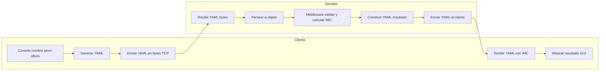

# Proyecto: Arquitectura Cliente – Middleware – Servidor (IMC con YAML)

Este proyecto implementa un sistema distribuido que calcula el **Índice de Masa Corporal (IMC)**.  

- **Cliente (Node.js):** pide datos por consola, construye un archivo **YAML**, lo envía en bytes por **TCP** y recibe la respuesta (también en YAML).  
- **Servidor + Middleware:** reciben los datos, los convierten a objeto, validan, calculan IMC y devuelven un YAML con el resultado.  

---

## Lo que ya está hecho (Cliente)

- El cliente en Node.js:
  - Pregunta **nombre, peso (kg), altura (m)** por consola.
  - Construye un archivo **YAML** con esos datos.
  - Lo envía al servidor en formato **bytes** con un encabezado de 4 bytes (`[longitud][payload]`).
  - Espera la respuesta del servidor en YAML.
  - Parsear el YAML recibido y muestra una “GUI” en consola con el resultado.

📂 Estructura actual:

```
bmi-sockets-node/
├─ package.json
└─ src/
   └─ client/
      ├─ cli.js         # Cliente TCP con consola
      └─ testLocal.js   # Script de prueba con YAML simulado
```

---

## 📦 Instalación

1. Clonar o copiar este repo.  
2. Instalar dependencias:  
   ```bash
   npm install
   ```
3. Ejecutar el cliente:  
   ```bash
   npm run client
   ```

---

## 🧪 Probar el cliente sin servidor

Para simular la respuesta del servidor:

1. Se creo un archivo de prueba `test/respuesta.yaml`:

   ```yaml
   ResultadoIMC:
     Persona:
       nombre: "Ana"
       pesoKg: 70
       alturaM: 1.75
     BMI: 22.9
     Categoria: "Healthy"
   ```

2. Ejecuta el script local:  
   ```bash
   node src/client/testLocal.js
   ```

3. Verás en consola una caja con el resultado y el YAML recibido.

---

## 📄 Ejemplos de YAML esperado del servidor

**Thin (<18.5):**
```yaml
ResultadoIMC:
  Persona:
    nombre: "Luis"
    pesoKg: 50
    alturaM: 1.80
  BMI: 15.4
  Categoria: "Thin"
```

**Healthy (18.6–24.9):**
```yaml
ResultadoIMC:
  Persona:
    nombre: "Ana"
    pesoKg: 70
    alturaM: 1.75
  BMI: 22.9
  Categoria: "Healthy"
```

**Overweight (25–29.9):**
```yaml
ResultadoIMC:
  Persona:
    nombre: "Carlos"
    pesoKg: 85
    alturaM: 1.70
  BMI: 29.4
  Categoria: "Overweight"
```

**Obese (>30):**
```yaml
ResultadoIMC:
  Persona:
    nombre: "Marta"
    pesoKg: 95
    alturaM: 1.60
  BMI: 37.1
  Categoria: "Obese"
```

---

## 🛠️ Siguientes pasos

 **Middleware (validación y cálculo IMC):**  
- Recibir YAML → parsear a objeto.  
- Validar datos (nombre, peso >0, altura >0).  
- Calcular IMC con la fórmula `IMC = peso / altura^2`.  
- Clasificar según criterios:  
  - `< 18.5`: Thin  
  - `18.6 – 24.9`: Healthy  
  - `25 – 29.9`: Overweight  
  - `>= 30`: Obese  

 **Servidor (Node.js con TCP sockets):**  
- Escuchar en `127.0.0.1:4000` o en cualquier otro puerto.  
- Leer mensajes en formato `[4 bytes longitud][YAML]`.  
- Pasar el YAML al middleware.  
- Construir un YAML de respuesta con `ResultadoIMC`.  
- Enviar de vuelta al cliente usando el mismo framing.  

 **Entrega conjunta:**  
- Cliente (ya listo).  
- Servidor + Middleware (por implementar).  
- Pruebas conjuntas enviando YAML en ambos sentidos.  

---

## Ejecución conjunta (cuando el servidor esté listo)

1. Arrancar el servidor:  
   ```bash
   npm run server
   ```
2. Luego correr el cliente:  
   ```bash
   npm run client
   ```
3. Cliente introduce datos → Servidor calcula IMC → Cliente muestra resultados.

---

## 📊 Diagrama de flujo (Cliente ↔ Servidor ↔ Middleware)


